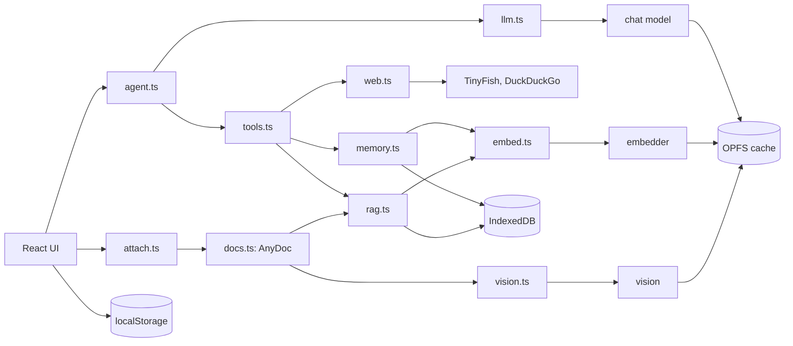
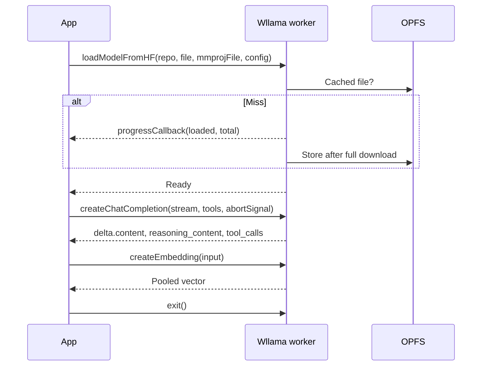
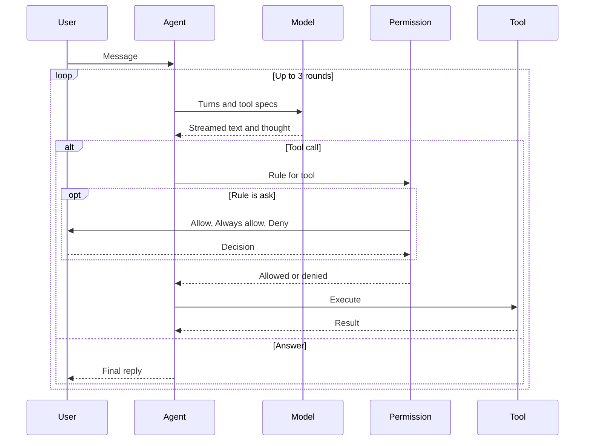
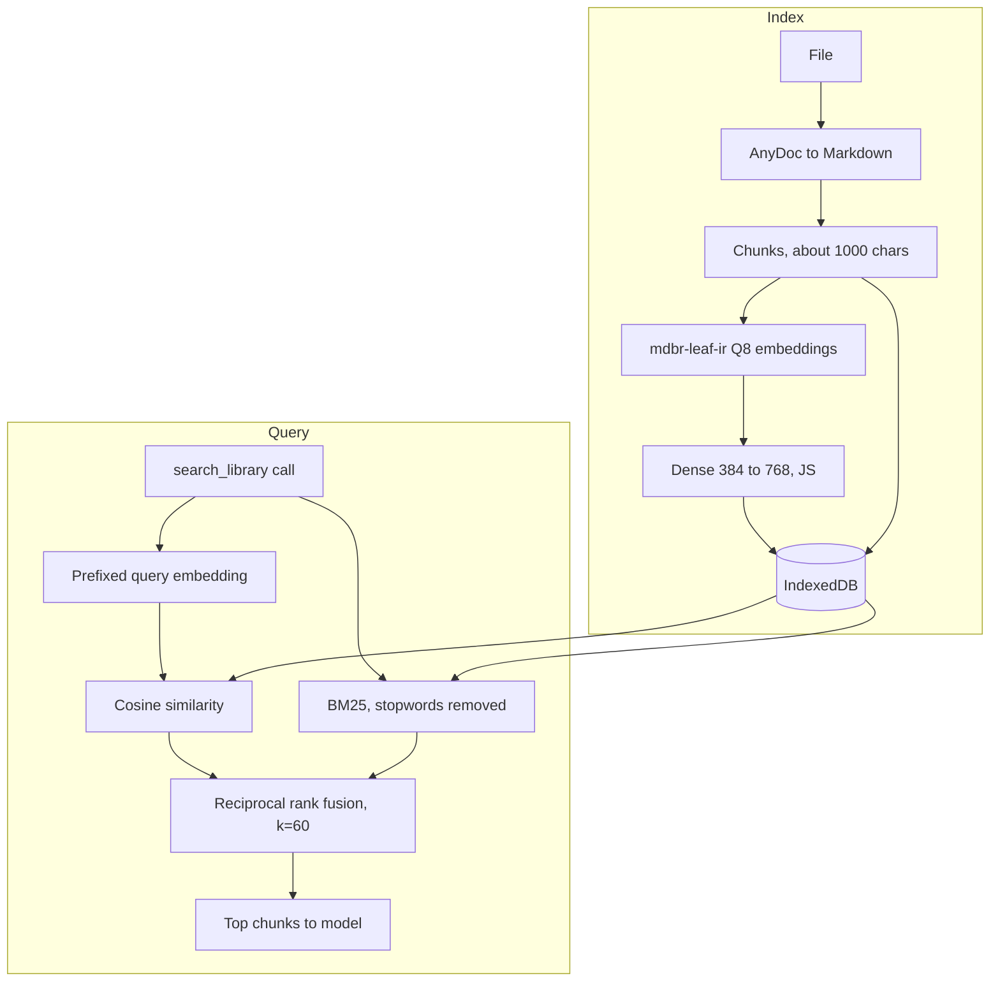
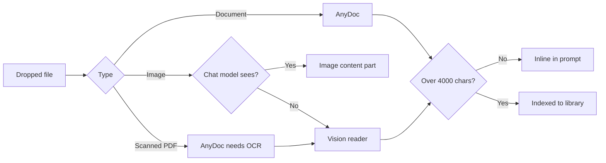

# Locus

Private AI chat running entirely in the browser. GGUF models execute through [wllama](https://github.com/ngxson/wllama) (llama.cpp compiled to WebAssembly) on CPU or WebGPU. No server, no telemetry.

## Features

- Local inference, OPFS-cached weights
- Agentic RAG, hybrid retrieval
- Clickable document citations, original PDF split viewer and exact cited passages
- Long-term memory, saved and searched by the agent
- Web search and fetch, TinyFish or DuckDuckGo
- Artifacts, sandboxed live preview
- Bring your own GGUF, drag and drop
- Tool calling, per-tool permissions
- Attachments through AnyDoc, vision
- Thinking mode, separate stream
- Markdown, KaTeX, code highlighting
- Chat fork, edit, retry, incognito
- Local English voice dictation with Moonshine Tiny Q8, backup export
- Read aloud beside Copy, local sanoTTS English voices; downloads on first use
- Chat sharing, Markdown or HTML

## Models

| Model | Size | Capabilities |
| --- | --- | --- |
| [LFM2.5 230M](https://huggingface.co/LiquidAI/LFM2.5-230M-GGUF) | 149 MB | Fast chat |
| [LFM2.5 VL 450M](https://huggingface.co/LiquidAI/LFM2.5-VL-450M-GGUF) | 332 MB | Vision |
| [MiniCPM5 1B](https://huggingface.co/openbmb/MiniCPM5-1B-GGUF) | 688 MB | Thinking, tools |

A model is one row in `src/lib/models.ts`: repo, file, optional `mmproj`, capability flags, sampling preset.

### Your own model

- Drop a `.gguf` in Settings, Model, with its `mmproj` file for vision
- Files are copied to OPFS, so they survive reloads without a download
- Loaded with `loadModel`; tool and thinking support are read from the chat template
- One dropped model at a time; a new drop replaces it

## Architecture



Each model runs in its own wllama instance and worker, so chat, embedding and image reading run concurrently. The picker swaps only the chat model.

Voice dictation uses Moonshine Tiny Q8 through a separate single-thread CrispASR WASM worker, without ONNX or WebGPU. The microphone downloads 33.9 MB of weights and a 0.25 MB tokenizer on first use, then caches them in Cache Storage. Phrases are transcribed after a pause or at 13 seconds; Stop finishes the final phrase, and clicking again cancels. Stopping or leaving the composer releases the microphone and worker memory. Microphone access requires HTTPS or localhost.

The vendored MIT runtime in `public/moonshine` comes from [CrisperWeaver commit ffa562b](https://github.com/CrispStrobe/CrisperWeaver/tree/ffa562b2cfd26bc0bb423255e4f832c6cd7098eb/web/wasm/crispasr-small), built from CrispASR `70e15c9a0`. Model assets are pinned to [cstr/moonshine-tiny-GGUF revision f9d70fd](https://huggingface.co/cstr/moonshine-tiny-GGUF/tree/f9d70fd5b08609291b0e1e41a69eed04e3f30009). The runtime adds 11.2 MB and used about 443 MiB of WASM memory in a desktop browser test.

Settings → Voice selects the read-aloud voice and playback speed, previews speech, deletes cached Moonshine weights, and unloads read-aloud weights from memory. Heart nano is the smallest default. Playback speed also changes pitch.

Settings → Models uses one picker with sampling controls collapsed. Run check measures up to 64 generated tokens with the loaded model and current backend, without changing chat history. The check can be cancelled; its result applies to that model and device, rather than predicting speed for other models.

## Wllama integration

`engine()` in `engine.ts` is the single factory for `new Wllama(...)`. Each call yields an independent llama.cpp WebAssembly instance in its own worker, with its own weights and KV cache. Chat (`llm.ts`), embedder (`embed.ts`) and vision reader (`vision.ts`) each own one.



| Call | Use |
| --- | --- |
| `loadModelFromHF` | Weights and optional `mmproj` image encoder |
| `loadModel` | Dropped GGUF files read back from OPFS |
| `getChatTemplate` | Detects tools and thinking on a dropped model |
| `createChatCompletion` | Streaming, tool specs, `AbortSignal` stop |
| `chat_template_kwargs.enable_thinking` | Toggles the reasoning block |
| `delta.reasoning_content` | Thought stream, shown separately |
| `delta.tool_calls` | Fragments keyed by `index`, merged client side |
| `createEmbedding` | `embd_normalize: -1`, raw pooled output |
| `exit` | Frees wasm memory on swap |

- Sampling (`temperature`, `top_k`, `top_p`, `min_p`, `repeat_penalty`) is a per-model preset, overridable in Settings
- `mmprojFile` enables image input as `{ type: "image", data: ArrayBuffer }` content parts
- Swapping models awaits any in-flight load before `exit`, so two loads never share an instance
- `exclusive()` marks the chat model busy during background work such as titling

## Chat and tool loop



- Tool calls stream in pieces keyed by index, then merge
- The last round offers no tools, forcing an answer
- Rules (`ask`, `allow`, `deny`) persist in localStorage
- Stop counts as deny
- Built-in tools: `search_library`, `save_memory`, `search_memory`, `search_web`, `fetch_page`, `calculator`, `datetime`
- Adding a tool is one entry in `tools.ts`

## Local RAG

New PDF uploads keep their original file in IndexedDB, alongside page numbers and passage offsets. Clicking an answer's numbered citation or opening **Sources** shows the whole PDF in a continuous scroll pane beside chat and jumps to the highlighted passage. The **Cited passage** tab shows the exact text supplied to the model. Page dimensions preserve the scroll layout; only nearby pages render, off-screen canvases are released, and closing the viewer releases its PDF worker. Small attachments go into the prompt with source links without loading the embedder; larger files use `search_library` with a tool-capable model such as MiniCPM5.

Word and PowerPoint files convert to formatted Markdown in a worker. Their document preview, and Markdown uploads, retain the complete text rather than rebuilding it from retrieval chunks. Headings, tables, code blocks and slide sections render with the existing Markdown component; Office previews do not reproduce the original page or slide layout. Older uploads fall back to their saved chunks.

Scanned pages keep their OCR passage and page number, but the current OCR has no word coordinates, so those pages show an explicit note instead of a guessed highlight. Older PDF uploads need re-uploading to retain their original file. Deleting a document removes its original PDF; saved replies retain the quoted passage. Chat backups contain citations but do not include PDF files.

To check manually:

1. Run `bun dev`, upload a fresh PDF with selectable text, and ask a specific question about a sentence in it. For a long PDF, select MiniCPM5 and allow Search library.
2. Click the small numbered citation, or expand Sources and select one. Confirm chat stays on the left and the original PDF opens on the cited page with yellow highlights.
3. Compare the Cited passage tab with the highlighted text. Scroll through the whole PDF, then press Cited passage above the pages to return to the highlight. Try a citation on a different page. On a desktop, try Expand document and Narrow document; the PDF should fit the pane and keep its highlight aligned. After browsing away, click the same citation again and confirm it returns to the highlighted passage.
4. Reload and reopen the saved citation. Resize to a phone width, then close the viewer and confirm chat remains usable.
5. Delete the document in Settings → Embeddings, then reopen its citation. The viewer should report the missing document while preserving Cited passage.
6. Upload Word, PowerPoint and Markdown files. Open their citations and confirm Document preserves headings, tables and the final section or slide; Cited passage retains the exact excerpt.



- Embedder: [mdbr-leaf-ir](https://huggingface.co/MongoDB/mdbr-leaf-ir), Q8 GGUF, 25 MB, 384-d mean pooling
- Dense projection to 768-d applied in JS, then L2-normalised
- One text per embedding call, since wllama 3.6 batching is unreliable
- Retrieval is a model decision through a tool, never an automatic prefix

### Retrieval maths

For a corpus of $N$ chunks, a query $q$ is scored by two independent rankers and fused by rank.

**Sparse, BM25** with $k_1 = 1.2$, $b = 0.75$ over lowercase word tokens, stopwords removed from $q$:

$$
\mathrm{BM25}(q,d)=\sum_{t\in q}\mathrm{IDF}(t)\cdot\frac{f(t,d)\,(k_1+1)}{f(t,d)+k_1\left(1-b+b\,\frac{|d|}{\mathrm{avgdl}}\right)}
$$

$$
\mathrm{IDF}(t)=\ln\left(1+\frac{N-n_t+0.5}{n_t+0.5}\right)
$$

**Dense**: the encoder emits a mean-pooled vector $h\in\mathbb{R}^{384}$. A linear layer projects it to $\mathbb{R}^{768}$, then L2 normalisation makes cosine similarity a dot product:

$$
v=\frac{W h+c}{\lVert W h+c\rVert_2},\qquad W\in\mathbb{R}^{768\times384}
$$

$$
s_{\mathrm{dense}}(q,d)=\hat v_q\cdot\hat v_d
$$

Queries are prefixed with `Represent this sentence for searching relevant passages: `, documents are not (asymmetric retrieval).

**Fusion**: reciprocal rank fusion over the two ranked lists, using ranks only so the incomparable score scales never mix:

$$
\mathrm{RRF}(d)=\sum_{r\in\{\mathrm{sparse},\,\mathrm{dense}\}}\frac{1}{k+\mathrm{rank}_r(d)},\qquad k=60
$$

| Property | Sparse | Dense |
| --- | --- | --- |
| Matches | Exact terms, rare names | Paraphrase, meaning |
| Fails on | Synonyms | Out-of-vocabulary identifiers |
| Cost | $O(N\cdot\lvert q\rvert)$ | $O(N\cdot 768)$ |
| Index | Computed per query | Stored per chunk |

Chunks with a score of zero in a list are dropped from that list before fusion. The top 4 fused chunks are returned to the model. Cost per query is one encoder pass plus a linear scan, with no ANN index, which is sound for personal libraries of up to tens of thousands of chunks.

## Memory

- `save_memory` stores one fact in IndexedDB; a near-duplicate replaces the old one
- The five facts most relevant to each message join the system prompt; `search_memory` finds more
- Incognito chats never offer `save_memory`; Settings, Embeddings lists and deletes facts

## Web

- `search_web` returns the top 5 results; `fetch_page` returns a page as Markdown, cut to 6000 characters
- With a TinyFish API key (free at agent.tinyfish.ai, pasted in Settings, Tools), both use TinyFish Search and Fetch
- Without a key, or if TinyFish fails, search reads DuckDuckGo's HTML results and fetch reads the page, both through the free Jina reader, since DuckDuckGo and most sites block browser requests
- These are the only calls besides model downloads, and each one runs under the tool's permission rule

## Artifacts

- The system prompt asks for one complete `html` block when the user wants a page, app, game, chart or drawing
- `html` and `svg` code blocks get a Preview button that opens the viewer
- The page runs in an iframe sandboxed without `allow-same-origin`, so it cannot read chats, keys or memory
- Preview and Code tabs, plus download as an `.html` file

## Sharing

- The header's share menu downloads the open chat as Markdown or a standalone HTML page
- The HTML page reuses the chat's renderer, with math and code, and needs no app to open

## Attachments



- Documents: PDF, Word, PowerPoint, Excel, text, code via [AnyDoc](https://github.com/firecrawl/anydoc) WASM
- Pictures and scanned pages: described and transcribed by LFM2.5 VL
- The vision reader loads on demand, then frees memory
- Image reading is capped at 2 threads, since more hang in wasm

## Stack

| Layer | Choice |
| --- | --- |
| UI | React 19, Vite |
| Style | Tailwind 4, shadcn on Base UI |
| Icons | Hugeicons |
| Inference | wllama 3.6 |
| Documents | AnyDoc |
| Storage | localStorage, IndexedDB, OPFS |

## Develop

```bash
bun install
bun dev
bun run check
bun src/lib/store.test.ts
bun src/lib/rank.test.ts
bun src/lib/speech.test.ts
bun src/components/model.test.tsx
bun src/lib/source.test.ts
```

### Runtime

| Setting | Value |
| --- | --- |
| Chat threads | All cores |
| Vision threads | 2 |
| Embedder threads | 2 |
| GPU layers | 0 on CPU |
| Chat context | `n_ctx` 8192, adjustable |
| Embedder context | 512, batch 512 |
| Vision context | 4096 |
| Backend | Auto, WebGPU on NVIDIA and Apple only |
| Weights | Cached in OPFS |

wllama runs llama.cpp in a pthread WebAssembly worker, so it needs cross-origin isolation. Vite sends `Cross-Origin-Opener-Policy: same-origin` and `Cross-Origin-Embedder-Policy: credentialless`; set the same on any host.

### Performance

- All cores for decode, about 60% faster than wllama's half-core default
- One worker per model, no reload when embedding or reading images
- Vision reader freed after use
- Embedder is a 25 MB Q8 model, CPU only
- Dense projection in JS, no second model
- Chat titles capped at 8 tokens
- Last tool round offers no tools, so loops end
- Large attachments indexed, not inlined
- Scanned page renderer loads lazily
- Image reading uses 2 threads, since more hang in wasm
- Sampling presets per model, from model authors

Decode is memory-bandwidth bound: each token reads every weight once, so

$$
\text{tokens/s}\lesssim\frac{B_{\mathrm{mem}}}{S_{\mathrm{weights}}}
$$

which is why Q4 and Q8 quantisation, rather than more threads, set the ceiling. Thread scaling only helps until $B_{\mathrm{mem}}$ saturates.

## License

[MIT](LICENSE) © Bharath Ajjarapu

Read aloud uses [sanotts-web](https://github.com/ampixa/sanoTTS), licensed GPL-3.0-or-later. Its WASM runtime is served locally; voice weights are fetched from Hugging Face with the upstream host as a fallback. Message text stays in the browser.
