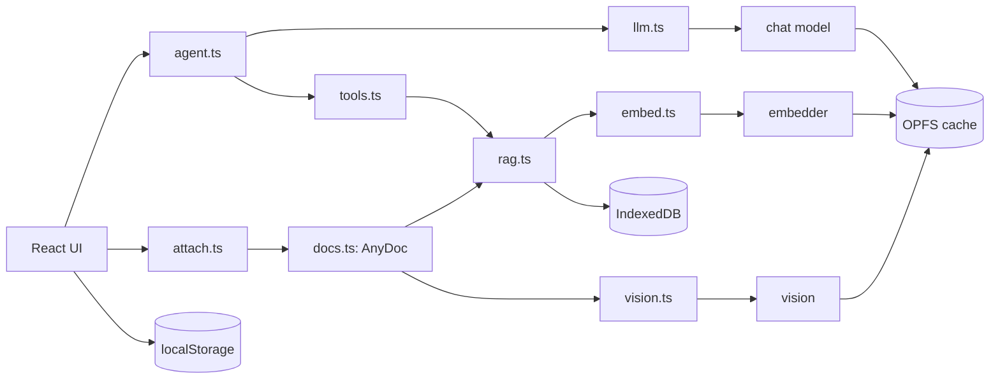
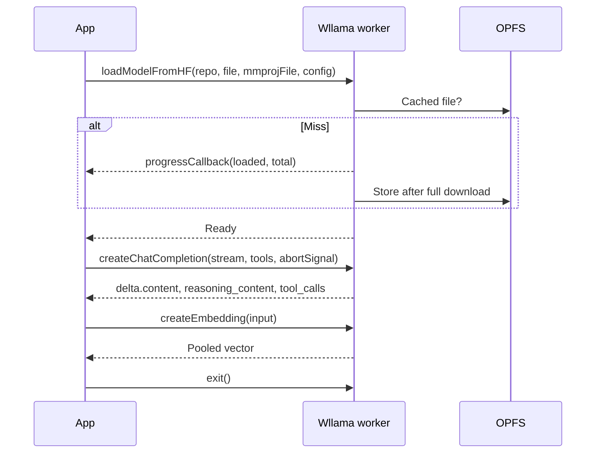
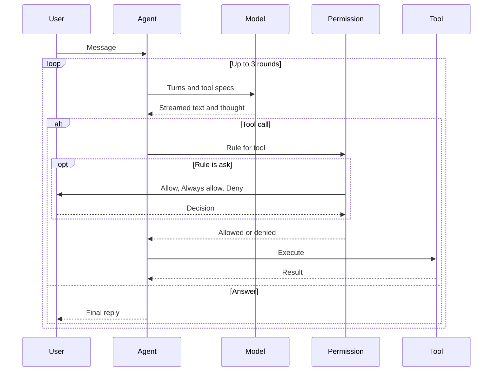
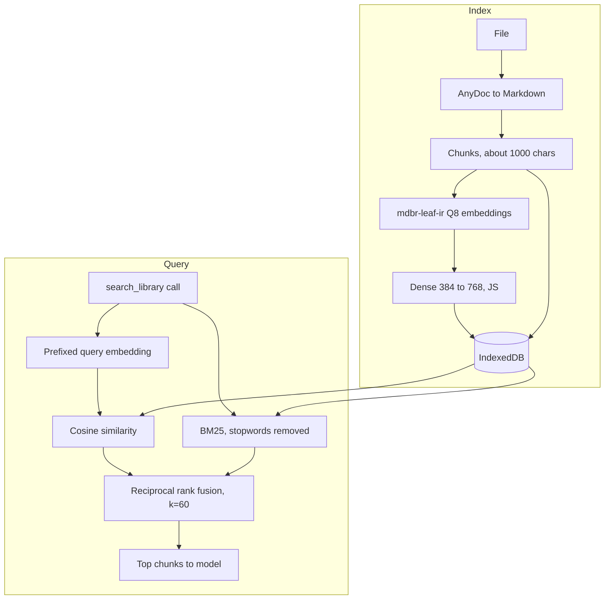
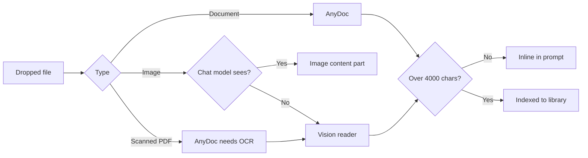

# Locus

Private AI chat running entirely in the browser. GGUF models execute through [wllama](https://github.com/ngxson/wllama) (llama.cpp compiled to WebAssembly) on CPU or WebGPU. No server, no telemetry.

## Features

- Local inference, OPFS-cached weights
- Agentic RAG, hybrid retrieval
- Tool calling, per-tool permissions
- Attachments through AnyDoc, vision
- Thinking mode, separate stream
- Markdown, KaTeX, code highlighting
- Chat fork, edit, retry, incognito
- Voice dictation, backup export

## Models

| Model | Size | Capabilities |
| --- | --- | --- |
| [LFM2.5 230M](https://huggingface.co/LiquidAI/LFM2.5-230M-GGUF) | 149 MB | Fast chat |
| [LFM2.5 VL 450M](https://huggingface.co/LiquidAI/LFM2.5-VL-450M-GGUF) | 332 MB | Vision |
| [MiniCPM5 1B](https://huggingface.co/openbmb/MiniCPM5-1B-GGUF) | 688 MB | Thinking, tools |

A model is one row in `src/lib/models.ts`: repo, file, optional `mmproj`, capability flags, sampling preset.

## Architecture



Each model runs in its own wllama instance and worker, so chat, embedding and image reading run concurrently. The picker swaps only the chat model.

## Wllama integration

`engine()` in `engine.ts` is the single factory for `new Wllama(...)`. Each call yields an independent llama.cpp WebAssembly instance in its own worker, with its own weights and KV cache. Chat (`llm.ts`), embedder (`embed.ts`) and vision reader (`vision.ts`) each own one.



| Call | Use |
| --- | --- |
| `loadModelFromHF` | Weights and optional `mmproj` image encoder |
| `createChatCompletion` | Streaming, tool specs, `AbortSignal` stop |
| `chat_template_kwargs.enable_thinking` | Toggles the reasoning block |
| `delta.reasoning_content` | Thought stream, shown separately |
| `delta.tool_calls` | Fragments keyed by `index`, merged client side |
| `createEmbedding` | `embd_normalize: -1`, raw pooled output |
| `exit` | Frees wasm memory on swap |

- Sampling (`temperature`, `top_k`, `top_p`, `min_p`, `repeat_penalty`) is a per-model preset, overridable in Settings
- `mmprojFile` enables image input as `{ type: "image", data: ArrayBuffer }` content parts
- Swapping models awaits any in-flight load before `exit`, so two loads never share an instance
- `exclusive()` marks the chat model busy during background work such as titling

## Chat and tool loop



- Tool calls stream in pieces keyed by index, then merge
- The last round offers no tools, forcing an answer
- Rules (`ask`, `allow`, `deny`) persist in localStorage
- Stop counts as deny
- Built-in tools: `search_library`, `calculator`, `datetime`
- Adding a tool is one entry in `tools.ts`

## Local RAG



- Embedder: [mdbr-leaf-ir](https://huggingface.co/MongoDB/mdbr-leaf-ir), Q8 GGUF, 25 MB, 384-d mean pooling
- Dense projection to 768-d applied in JS, then L2-normalised
- One text per embedding call, since wllama 3.6 batching is unreliable
- Retrieval is a model decision through a tool, never an automatic prefix

### Retrieval maths

For a corpus of $N$ chunks, a query $q$ is scored by two independent rankers and fused by rank.

**Sparse, BM25** with $k_1 = 1.2$, $b = 0.75$ over lowercase word tokens, stopwords removed from $q$:

$$
\mathrm{BM25}(q,d)=\sum_{t\in q}\mathrm{IDF}(t)\cdot\frac{f(t,d)\,(k_1+1)}{f(t,d)+k_1\left(1-b+b\,\frac{|d|}{\mathrm{avgdl}}\right)}
$$

$$
\mathrm{IDF}(t)=\ln\left(1+\frac{N-n_t+0.5}{n_t+0.5}\right)
$$

**Dense**: the encoder emits a mean-pooled vector $h\in\mathbb{R}^{384}$. A linear layer projects it to $\mathbb{R}^{768}$, then L2 normalisation makes cosine similarity a dot product:

$$
v=\frac{W h+c}{\lVert W h+c\rVert_2},\qquad W\in\mathbb{R}^{768\times384}
$$

$$
s_{\mathrm{dense}}(q,d)=\hat v_q\cdot\hat v_d
$$

Queries are prefixed with `Represent this sentence for searching relevant passages: `, documents are not (asymmetric retrieval).

**Fusion**: reciprocal rank fusion over the two ranked lists, using ranks only so the incomparable score scales never mix:

$$
\mathrm{RRF}(d)=\sum_{r\in\{\mathrm{sparse},\,\mathrm{dense}\}}\frac{1}{k+\mathrm{rank}_r(d)},\qquad k=60
$$

| Property | Sparse | Dense |
| --- | --- | --- |
| Matches | Exact terms, rare names | Paraphrase, meaning |
| Fails on | Synonyms | Out-of-vocabulary identifiers |
| Cost | $O(N\cdot\lvert q\rvert)$ | $O(N\cdot 768)$ |
| Index | Computed per query | Stored per chunk |

Chunks with a score of zero in a list are dropped from that list before fusion. The top 4 fused chunks are returned to the model. Cost per query is one encoder pass plus a linear scan, with no ANN index, which is sound for personal libraries of up to tens of thousands of chunks.

## Attachments



- Documents: PDF, Word, PowerPoint, Excel, text, code via [AnyDoc](https://github.com/firecrawl/anydoc) WASM
- Pictures and scanned pages: described and transcribed by LFM2.5 VL
- The vision reader loads on demand, then frees memory
- Image reading is capped at 2 threads, since more hang in wasm

## Stack

| Layer | Choice |
| --- | --- |
| UI | React 19, Vite |
| Style | Tailwind 4, shadcn on Base UI |
| Icons | Hugeicons |
| Inference | wllama 3.6 |
| Documents | AnyDoc |
| Storage | localStorage, IndexedDB, OPFS |

## Develop

```bash
bun install
bun dev
bun run check
bun src/lib/store.test.ts
bun src/lib/rank.test.ts
```

### Runtime

| Setting | Value |
| --- | --- |
| Chat threads | All cores |
| Vision threads | 2 |
| Embedder threads | 2 |
| GPU layers | 0 on CPU |
| Chat context | `n_ctx` 8192, adjustable |
| Embedder context | 512, batch 512 |
| Vision context | 4096 |
| Backend | Auto, WebGPU on NVIDIA and Apple only |
| Weights | Cached in OPFS |

wllama runs llama.cpp in a pthread WebAssembly worker, so it needs cross-origin isolation. Vite sends `Cross-Origin-Opener-Policy: same-origin` and `Cross-Origin-Embedder-Policy: credentialless`; set the same on any host.

### Performance

- All cores for decode, about 60% faster than wllama's half-core default
- One worker per model, no reload when embedding or reading images
- Vision reader freed after use
- Embedder is a 25 MB Q8 model, CPU only
- Dense projection in JS, no second model
- Chat titles capped at 8 tokens
- Last tool round offers no tools, so loops end
- Large attachments indexed, not inlined
- Scanned page renderer loads lazily
- Image reading uses 2 threads, since more hang in wasm
- Sampling presets per model, from model authors

Decode is memory-bandwidth bound: each token reads every weight once, so

$$
\text{tokens/s}\lesssim\frac{B_{\mathrm{mem}}}{S_{\mathrm{weights}}}
$$

which is why Q4 and Q8 quantisation, rather than more threads, set the ceiling. Thread scaling only helps until $B_{\mathrm{mem}}$ saturates.

## License

[MIT](LICENSE) © Bharath Ajjarapu
